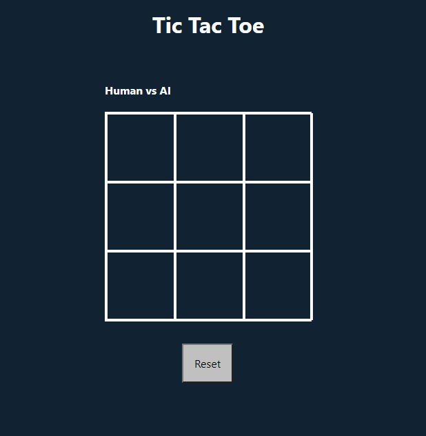

# TicTacToe React Project
> <a href="https://armaankara.github.io/tictactoe/">Demo</a>
## Table of Contents
* [General Info](#general-information)
* [Technologies Used](#technologies-used)
* [Screenshots](#screenshots)
* [Setup](#setup)
* [Usage](#usage)
* [Project Status](#project-status)
* [Acknowledgements](#acknowledgements)
* [Contact](#contact)
<!-- * [License](#license) -->
## General Information
- This fun project is to show case my intermeidate React skills. 

- Feel free to try it out in the deployments sidebar.

- Project Objectives:
  - Build a webapp using create-react-app and deploy it to Github Pages
  - Work with React hooks
  - Get better with Git version control
## Technologies
- React (Javascript ES6)
- HTML5
- CSS3
- Git and Github
- Command Line
- VSCode

## Screenshot



## Setup and Usage

For this project to work in your own computer, you'll need to have npm and node installed first.

1. Open your terminal and then type
    ```
    $ git clone https://github.com/ArmaanKara/tictactoe.git
    ```
2. cd into the cloned respository folder so you are at root of the directory

3. Check pacage.json file and ensure scripts are notated as below:
    ```
    "scripts": {
    "start": "react-scripts start",
    "build": "react-scripts build",
    "test": "react-scripts test",
    "eject": "react-scripts eject"
    },
    ```
4. (Optional) Delete the node_modiles and folder and any 'lock' files such as yarn.lock or package-lock.json if present

5. Run npm in the the root of the directory
     ```
    $ npm install
    ```
    This will install the required dependencies


6. To Run the React project and then when you make changes see those changes live in your browser run

    ``` 
    $ npm start
    ```


## Project Status
_Completed_


## Contact
Created by <a href="armaankara">@armaankara </a> - feel free to contact me!

## License
This project is open source.
